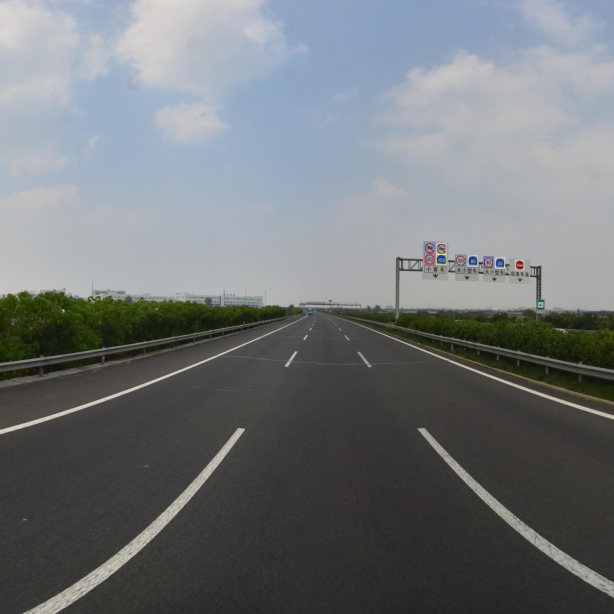

# 基于TensorFlow的交通标志实时检测与识别

Note: 这个仓库是[这个](https://github.com/qingswu/Traffic_sign_detect)仓库的修改版，具体请看[这个](https://github.com/qingswu/Traffic_sign_detect)仓库。

## Prerequisites
 * Python 3.5
 * TensorFlow >= 1.0.0
 * Numpy
 * easydict
 * PIL
 * OpenCV >= 3.0.0
 
## Result
  

## Usage
本项目里面提供了训练好的模型，只需要在Prerequisites满足后简单的执行:
 
`$ python runAll.py`
 
## References
* [qingswu/Traffic_sign_detect](https://github.com/qingswu/Traffic_sign_detect)

